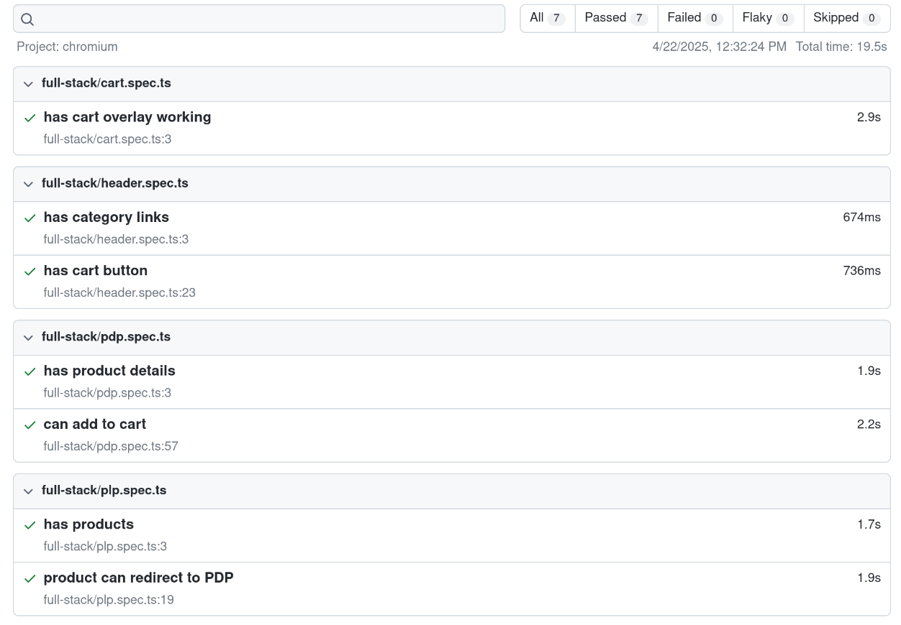

# Scandiweb Full Stack Developer Test Project

This is a full-stack e-commerce project built with a React + TypeScript frontend and a PHP + MySQL backend. The application allows users to browse products by category, view product details, and (in progress) manage a shopping cart. It uses GraphQL for API communication between the frontend and backend.

---

## Table of Contents

- Features  
- Demo Video  
- Test Results  
- Tech Stack  
- Project Structure  
- Setup and Installation  
  - Backend Setup  
  - Frontend Setup  
- Available Scripts  
- Development Notes  
- Linting & Code Quality  
- Future Improvements  
- Deployment  

---

## Features

- 🛍️ **Product Browsing:** View and filter products by category (Clothes, Tech, etc.)  
- 🔍 **Product Details Page:** Includes image gallery, pricing, and configurable options  
- 🛒 **Cart (WIP):** Cart component available, full logic in progress  
- ⚡ **GraphQL API:** Communication between frontend and backend via GraphQL  
- 💅 **Responsive UI:** Styled with TailwindCSS  
- 🔧 **Full Stack Architecture:** MySQL + PHP backend, React + TypeScript frontend  

---

## Demo Video

A quick demo of the project is available below:


---

## Test Results

The project has successfully passed all tests. Below is a screenshot of the test results:



---

## Tech Stack

### Frontend

- React  
- TypeScript  
- Vite  
- TailwindCSS  
- Apollo Client (GraphQL)  

### Backend

- PHP  
- MySQL  
- Composer  
- GraphQL (custom implementation)

---

## Project Structure

```bash
.
├── frontend/
│   └── ... (React + TS + Vite project files)
├── backend/
│   ├── .env
│   ├── scandi_db.sql
│   ├── public/
│   ├── routes/
│   ├── src/
│   └── vendor/
```

---

## Setup and Installation

### Backend Setup

1. **Set MySQL credentials**

Create a `.env` file inside the `backend/` folder:

```env
DB_HOST=localhost
DB_NAME=scandiweb
DB_USER=root
DB_PASS=your_password
```

2. **Create MySQL database**

Run this command from the `backend/` directory:

```bash
cat scandi_db.sql | mysql -u root -p
```

3. **Import products data**

```bash
php src/Config/import.php
```

4. **Install PHP dependencies**

```bash
composer install
```

5. **Run the backend server**

```bash
php -S localhost:8000 -t public
```

The GraphQL endpoint will be accessible at:  
`http://localhost:8000`

---

### Frontend Setup

1. **Navigate to frontend directory**

```bash
cd frontend
```

2. **Install Node dependencies**

```bash
npm install
```

3. **Run the dev server**

```bash
npm run dev
```

Frontend will be available at:  
`http://localhost:5173`

---

## Available Scripts

### Frontend

```bash
npm run dev        # Start Vite dev server
npm run build      # Build for production
npm run preview    # Preview production build
npm run lint       # Run ESLint
```

---

## Development Notes

- Product data is fetched via Apollo Client from the GraphQL backend.  
- Cart logic is still being implemented, with a structure in place for dropdown UI.  
- The backend includes a custom-built GraphQL implementation in PHP.  

---

## Linting & Code Quality

The project uses ESLint with TypeScript and React settings.  
You can extend the configuration to include more strict or type-aware rules.

---

## Future Improvements

- [ ] Full cart functionality with quantity and removal support  
- [ ] Persist cart using localStorage or backend  
- [ ] Add authentication & user orders  
- [ ] Improve backend architecture with MVC patterns  
- [ ] Implement unit testing  

---

## Deployment

The project is deployed using the following platforms:

- **Frontend:** Deployed on Vercel  
- **Backend:** Hosted with JAWS DB and deployed via Heroku  

You can access the live project here:  
➡️ **Frontend URL:** [https://scandiweb-test-five.vercel.app/](https://scandiweb-test-five.vercel.app/)  
➡️ **Backend URL:** [https://scandibackend-fcef480964fb.herokuapp.com/graphql](https://scandibackend-fcef480964fb.herokuapp.com/graphql)  

---

## License

MIT License – feel free to use and modify!
