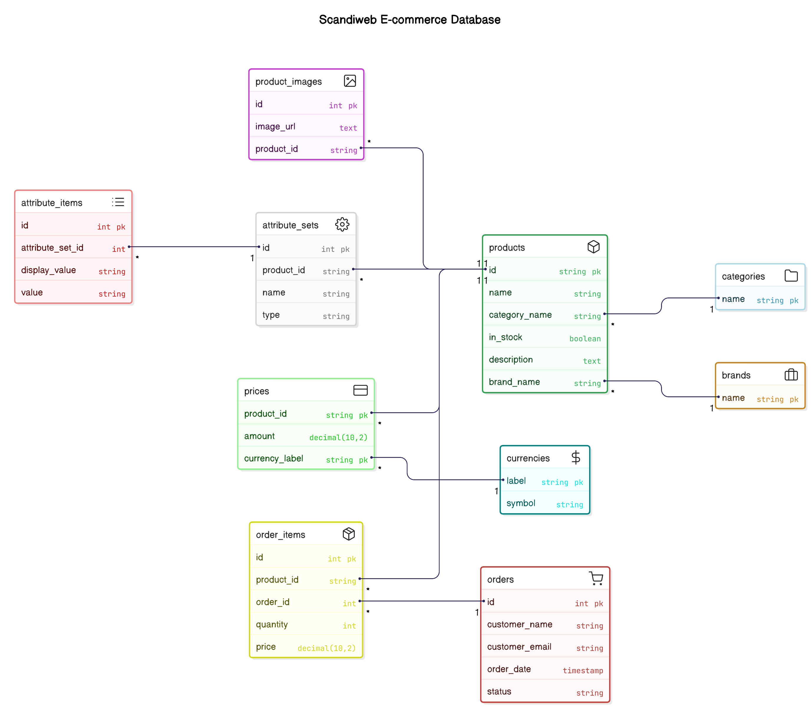

# Scandiweb Backend

A PHP-based backend service that provides product and order management functionality through GraphQL APIs.

## Project Overview

This backend is designed to serve an e-commerce application with the following features:

- Product catalog management with categories, images, and prices  
- Product attribute management (sizes, colors, etc.)  
- Order processing system  
- GraphQL API endpoints  

## Installation

### Prerequisites

- PHP 7.4 or higher  
- MySQL 5.7 or higher  
- Composer  

### Setup

1. Clone the repository  
2. Install dependencies  
3. Set up environment variables  
4. Create the database using the provided MySQL script (`backend/scandi_db.sql`)  
5. Import the data using `config/import.php` 
6. Test the connection  

## Configuration

Edit the `.env` file with your database configuration.

## API Endpoints

### GraphQL API

- `POST /graphql` - GraphQL endpoint  

#### GraphQL Queries

- `products` - Get all products  
- `product(id: String!)` - Get product details by ID  

#### GraphQL Mutations

- `createOrder` - Create a new order  

To fetch data, always send a POST request to the backend host's `/graphql` endpoint with the appropriate GraphQL query.

## Project Structure
### REST API (Testing Only)

This project primarily uses GraphQL for client-server communication. However, a simple REST API is also included for testing purposes:

- `GET /api/products` - Get all products (testing only)

> **Note:** The REST endpoints in `routes/routes.php` are not part of the main application flow and are provided only for development and testing purposes. Production applications should use the GraphQL endpoint.
├── public/              # Public directory with entry point
│   └── index.php        # Main entry point for GraphQL API
├── src/                 # Source code
│   ├── Config/          # Configuration files
│   ├── Controller/      # Controller classes
│   └── Models/          # Model classes
└── ...

## Development
### Adding New Products

Products can be added to the database by:  

1. Directly modifying the database  
2. Adding products to the `scandi_data.json` file and running `import.php`  

## CORS Configuration

CORS is enabled for the following origins:  

- `http://localhost:5173` (Local development)  
- `https://scandiweb-test-five.vercel.app` (Production)  

To add more allowed origins, edit both:  

- `index.php`  
- `routes.php`  
- `GraphQL.php`  

## Deployment

1. Upload all files to your server  
2. Set up the database  
3. Configure your web server to point to the `public` directory  
4. Ensure the `.env` file has the correct production values  

## Troubleshooting

If you encounter issues with the deployment:  

- Check database connection with `php test_connection.php`  
- Ensure the web server has appropriate permissions  
- Verify that all required PHP extensions are enabled  
- Check the error logs for more details  

## License

MIT License  
